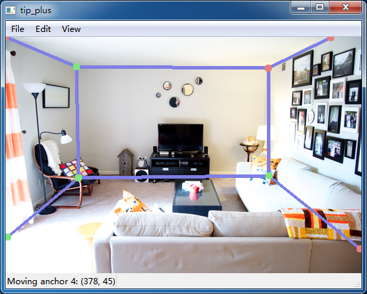
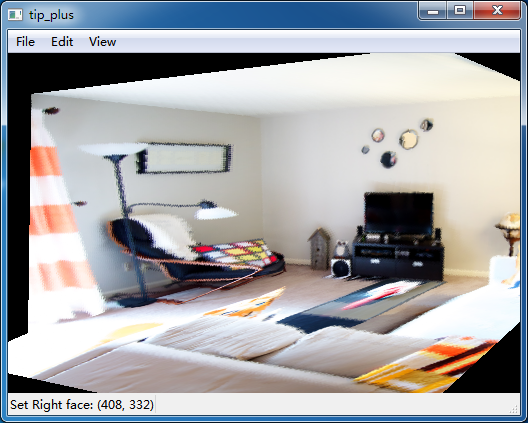
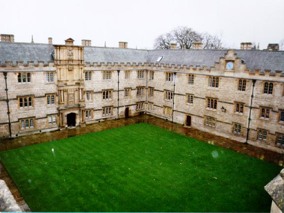
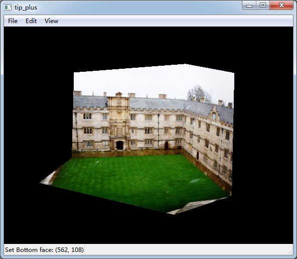
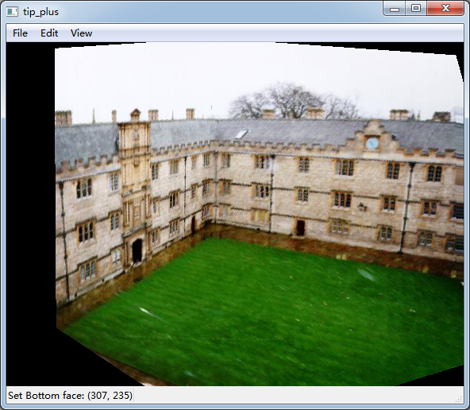

# Documentation
### Overview 
A improved implementation of the SIGGRAPH '97 paper: Tour Into the Picture

### Usage
Note: the path of the shaders is now hard-coded as './Shaders/xxx.glsl'. If the window is white when you open the excutable file, the program does not find the shaders. Please put the 'Shader' folder to the correct relative path.

**Steps**:

1. Press Ctrl+O to open a image file. A series of control points will appear indicating the structure. There are 5 faces (front, left, right, top, bottom) initially.

2. Press Ctrl+M to move the control point. The id and the position of it is shown on the status bar.

3. You should carefully set the position of control points 0~3. 0 is origin; 1,2,3 shows the direction of X,Y,Z axis.

4. When 0~3 is set, press Ctrl+F to build the coordinate system.

   

5. You can further edit the control points.

6. When there are less than 5 faces appear in the image, you can delete some control points by pressing Ctrl+D and clicking on it.

7. Now add extra points the each face. In particular, you should assign the face id to each corner of the image. This can be done by pressing Ctrl+1~5 and the selecting the point in image. Current face name is shown on the status bar.

8. Now you can press Ctrl+R to make 3D proxy of the scene. To view the model, press Alt+3 and use mouse to manipulate it.

   

### Other results
** Source image**
    

** One view**
    

** Other view**
    

### Notice
Due to the improper useage of OpenGL encapsulation in Qt, this code can only be compiled under Qt5.5.1. When I tried in Qt5.7, although it pass the compiling, the image cannot be displayed in run time.

Rewriting the OpenGL invocation remains as further work.
